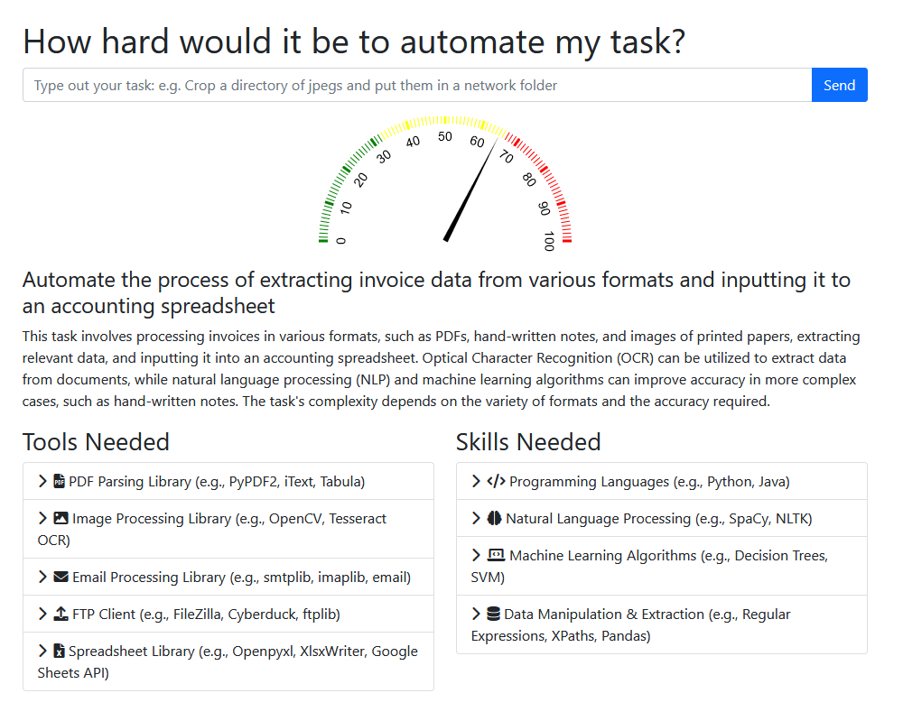

# Your App Name

Your App Name is a single-page application built using Bootstrap 5. The app takes JSON data and presents it in a visually appealing format, with a dial graphic for the score, explainer text, and side-by-side list boxes for tools and skills.



## Features

- Input field and send button for user questions
- Dial graphic to display the score
- Explainer text area with a header to show the user's question
- Two side-by-side list boxes for tools and skills, with bullet list icons

## Getting Started

These instructions will help you set up the project on your local machine for development and testing purposes.

### Prerequisites

- A web browser (e.g., Chrome, Firefox, Safari)
- A code editor (e.g., Visual Studio Code, Sublime Text)

### Installation

1. Clone the repository to your local machine:

``` git clone https://github.com/falldeaf/automation-advisor.git ```

2. Open the project folder in your code editor.

3. Open the `index.html` file in your web browser to view and interact with the app.

## Usage

Type your question in the input field and click the "Send" button. The button will show a loading icon and disable itself briefly, simulating an API call. Once the data is loaded, the app will display the score, explainer text, and the tools and skills lists.

## Contributing

If you're interested in contributing to this project, feel free to submit a pull request, or create an issue to discuss your ideas.

## License

This project is licensed under the MIT License - see the [LICENSE](LICENSE) file for details.
